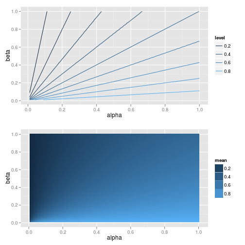

```r
library(ggplot2)
library(gridExtra)
```


# Exercise 2.11.5
> Posterior distribution as compromise between information and data:
> let $y$ be the number of heads in $n$ spins of a coin, whose probability of heads is $\theta$.
>
> (a). If your prior distribution for $\theta$ is uniform on the range $[0,1]$, derive your prior predictive distribution for $y$,
>
>$$
Pr(y=k) = \int_0^1 Pr(y=k|\theta)d\theta,
$$
> for each $k=0,1,ldots,n.$
>
> (b) Suppose you assign a $\text{Beta}(\alpha, \beta)$ prior distribution for $\theta$, and then you observe $y$ heads out of $n$ spins. Show algebraically that your posterior mean of $\theta$ always lies between your prior mean, $\frac{\alpha}{\alpha + \beta}$ and the observed relative frequency of heads, $\frac{y}{n}$.
>
> (c) Show that, if the prior distribution on $\theta$ is uniform, the posterior variance of $\theta$ is always less than the prior variance.
>
> (d) Give an example of a $\text{Beta}(\alpha, \beta)$ prior distribution and data $y, n$, in which the posterior variance of $\theta$ is higher than the prior variance.

# Derive prior predictive distribution
From equation 2.5, we know that 

$$
\begin{array}{ll}
Pr(y=k) & = \int_0^1 Pr(y=k|\theta)d\theta \\
        & = \int_0^1 \binom{n}{y} \theta ^ y (1 - \theta)^{n-y}d\theta \\
        & = \frac{1}{n+1}
\end{array}

$$


# Examine simulation for given n over uniform $\theta$
The following simulation agrees with the simulation above.
the simulation 

* draws observations from a binomial distribution over a grid of values of $\theta$ from 0 to 1 for various values of $n$,
* summarises the proportions of each $k$ in the sample,
* compares this to the exact value based on the formula above.


```r
simulate_binom <- function(n) {
    y <- rbinom(1e+06, n, seq(0, 1, length.out = 1000))
    Props <- round(prop.table(table(y)), 3)
    Exact <- round(1/(n + 1), 3)
    list(Props = Props, n = n, Exact = Exact)
}

simulate_binom(4)
```


```
## $Props
## y
##     0     1     2     3     4 
## 0.201 0.199 0.201 0.199 0.200 
## 
## $n
## [1] 4
## 
## $Exact
## [1] 0.2
## 
```


```r
simulate_binom(9)
```


```
## $Props
## y
##     0     1     2     3     4     5     6     7     8     9 
## 0.101 0.100 0.100 0.100 0.100 0.100 0.100 0.100 0.100 0.100 
## 
## $n
## [1] 9
## 
## $Exact
## [1] 0.1
## 
```


```r
simulate_binom(19)
```


```
## $Props
## y
##    0    1    2    3    4    5    6    7    8    9   10   11   12   13   14 
## 0.05 0.05 0.05 0.05 0.05 0.05 0.05 0.05 0.05 0.05 0.05 0.05 0.05 0.05 0.05 
##   15   16   17   18   19 
## 0.05 0.05 0.05 0.05 0.05 
## 
## $n
## [1] 19
## 
## $Exact
## [1] 0.05
## 
```


# Exploring the Beta distribution
I thought it would be useful to explore the beta distribution.
## Plotting Beta distribution for different alpha and beta
First, let's look at a plot of the beta distribution with different values of $alpha$ and $\beta$.


```r
values <- c(0.5, 0.75, 1, 2, 3)
Input <- expand.grid(alpha = values, beta = values)

par(mfrow = c(5, 5))
for (i in seq(nrow(Input))) {
    curve(dbeta(x, Input[i, "alpha"], Input[i, "beta"]), xlab = "x", ylab = "p(x)")
    title(paste("alpha=", Input[i, "alpha"], "\n", "beta=", Input[i, "beta"]))
}
```

 


* $\alpha=1; \beta=1$ is a uniform variable.
* When $\alpha = \beta$, the distribution is symmetric with a mean of 0.5.
* Swapping the values of $\alpha$ and $\beta$ results in a vertical reflection around the line at $x=0.5$.
* When $\alpha < 1$ and $\beta < 1$, the distribution is bimodal.
* When $\alpha > 1$ and $\beta > 1$, the distribution is unimodal, where the mode is between the minimum and maximum.

## Graphical representation of Beta mean
The following plots examine the mean of $\text{Beta}(\alpha, \beta)$.
The mean is $\frac{\alpha}{\alpha + \beta}$.


```r
Data <- expand.grid(alpha = seq(0.01, 1, length = 100), beta = seq(0.01, 
    1, length = 100))
Data$mean <- with(Data, alpha/(alpha + beta))
p1 <- ggplot(Data, aes(x = alpha, y = beta, z = mean)) + stat_contour(aes(colour = ..level..))
p2 <- ggplot(Data, aes(x = alpha, y = beta, z = mean)) + geom_tile(aes(fill = mean)) + 
    stat_contour(geom = "polygon", aes(fill = ..level..))
grid.arrange(p1, p2, nrow = 2)
```

 


# Simulate to show prior, sample, and posterior mean


```r
plot_posterior <- function(y, n, Alpha, Beta) {
    prior_mean <- Alpha / (Alpha + Beta)
    sample_mean <- y/n
    
    
    Theta <- seq(0, 1, length=1000)
    theta_likelihood <- dbinom(y, n, Theta) 
    theta_prior <- dbeta(Theta, Alpha, Beta)
    theta_posterior <- theta_likelihood * theta_prior / sum(theta_likelihood * theta_prior)
    posterior_mean <- sum(Theta * theta_posterior)

#    Note that prior mean and sample mean could be cacluated in a similar way
#    as a normalised product
#    sum(Theta * theta_prior / sum(theta_prior))
#    sum(Theta * theta_likelihood / sum(theta_likelihood))
    
    par(mfrow=c(3,1))
    plot(Theta, theta_prior, pch='.', 
         cex.lab=1.5, cex.axis=1.5, cex.main=1.5, cex.sub=1.5); abline(v=prior_mean)
    plot(Theta, theta_likelihood, pch='.', 
         cex.lab=1.5, cex.axis=1.5, cex.main=1.5, cex.sub=1.5); abline(v=sample_mean)
    plot(Theta, theta_posterior, pch='.',
         cex.lab=1.5, cex.axis=1.5, cex.main=1.5, cex.sub=1.5); abline(v=posterior_mean)
    
    round(rbind(prior_mean=prior_mean, 
                posterior_mean=posterior_mean,
                sample_mean=sample_mean), 3)
}
```


* Most of this is sraightforward.
* The function uses a 1000-point grid over the interval $[0, 1]$ to calculate the prior, likelihood, and posterior. 
* In order to convert the posterior into a density it needs to be normalised, hence the division by the sum of all values of the likelihood and the prior.
* In general, the mean of a continuous variable is $\int_{-\infty}^{\infty} x f(x) dx$. In the case of a random variable that does not have support on the entire real line, then the formula is adjusted to only integrate over the set that represents the support. In the present case the support is the interval $(0, 1)$.


## Example 1


```r
plot_posterior(y = 5, n = 10, Alpha = 1, Beta = 1)
```

 

```
##                [,1]
## prior_mean      0.5
## posterior_mean  0.5
## sample_mean     0.5
```


* In this first example, the mean of the likelihood and the prior are the same, and naturally the posterior is the same.
* The prior is uniform; thus the posterior takes on the shape of the likelihood.

## Example 2


```r
plot_posterior(y = 5, n = 10, Alpha = 2, Beta = 1)
```

 

```
##                 [,1]
## prior_mean     0.667
## posterior_mean 0.538
## sample_mean    0.500
```


* In this example, the posterior mean is greater than the likelihood mean. 
The posterior mean is in between the two values. 
* In this case it is closer to the likelihood mean than it is to the posterior mean.
* Because the prior is not flat, especially over values deemed probable by the likelihood, the shape of the posterior differs slightly to the 


## Example 3


```r
plot_posterior(y = 50, n = 100, Alpha = 1, Beta = 1)
```

 

```
##                [,1]
## prior_mean      0.5
## posterior_mean  0.5
## sample_mean     0.5
```


## Example 4


```r
plot_posterior(y = 50, n = 100, Alpha = 2, Beta = 1)
```

 

```
##                 [,1]
## prior_mean     0.667
## posterior_mean 0.505
## sample_mean    0.500
```


